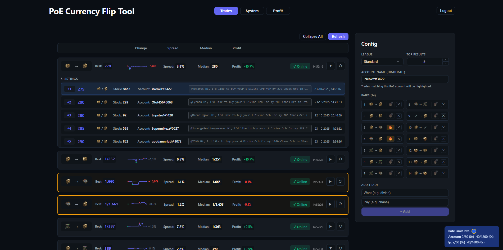
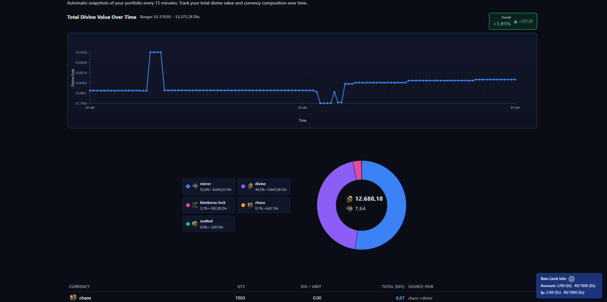
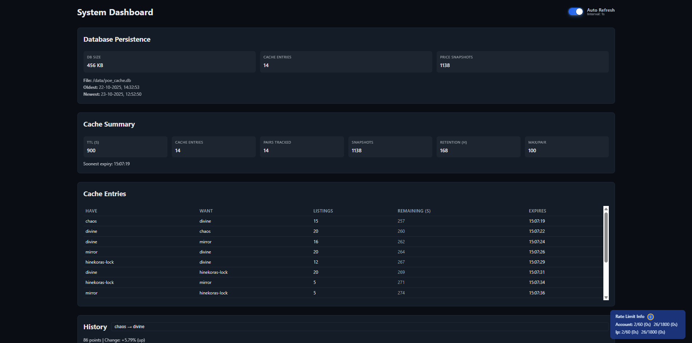
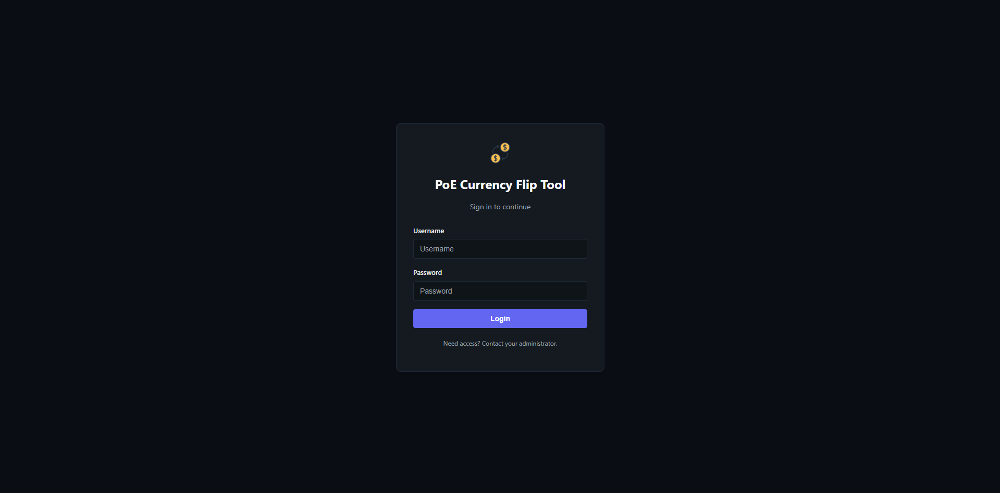

# ⚡ PoE Flip Tool

Real-time market analysis for **Path of Exile** currency trading. Track profitable flips, monitor your wealth, and enjoy a modern UI with live data and smart caching.


[](https://github.com/Pepijnvdliefvoort/poe-flip-tool/actions/workflows/backend-ci.yml)
[](https://github.com/Pepijnvdliefvoort/poe-flip-tool/actions/workflows/deploy-fly.yml)
[](https://github.com/Pepijnvdliefvoort/poe-flip-tool/actions/workflows/frontend-pages.yml)

---

## 📸 Screenshots

**Market Trading View**


**Profit Tracker**


**System Dashboard**


**Login Page**


---

## 🚀 Features

- Live PoE market data & profit calculations
- Automated portfolio tracking (snapshots every 15 min)
- Smart caching & rate limit protection
- Price trends, sparkline charts, and trade highlights
- Click-to-copy whisper messages
- Modern, responsive UI
- System dashboard for cache & DB stats
- Easy config via REST API
- One-command deploy to Fly.io

---

## 🛠️ Quick Install

**Requirements:** Python 3.8+, Node.js 16+, PoE account cookies

**Clone & Backend:**
```bash
git clone https://github.com/Pepijnvdliefvoort/poe-flip-tool.git
cd poe-flip-tool/backend
pip install -r requirements.txt
copy .env.example .env  # Edit with your POESESSID and CF_CLEARANCE
python -m uvicorn backend.main:app --reload
```
Backend runs at http://localhost:8000

**Frontend:**
```bash
cd ../frontend
npm install
copy .env.example .env  # (Optional: set your account name)
npm run dev
```
Frontend runs at http://localhost:5173

---

## ☁️ Deploy to Fly.io

1. [Install Fly CLI](https://fly.io/docs/hands-on/install-flyctl/)
2. `fly volumes create db_data --region ams --size 3`
3. `fly secrets set POESESSID=... CF_CLEARANCE=...`
4. `fly deploy`

Update frontend `.env` with your Fly.io backend URL if needed.

---

## 🎮 Usage

1. Configure trade pairs & league in the sidebar
2. Click "Refresh Trades" for live data
3. View profit, trends, and copy whispers
4. Use the "Profit" tab to track your wealth over time
5. System tab shows cache/database stats

API: See `/api/config`, `/api/trades/stream`, `/api/history/{have}/{want}`, `/api/portfolio/*` for endpoints.

---

## 📦 Tech Stack

- **Backend:** FastAPI, Uvicorn, Pydantic, SQLite
- **Frontend:** React, TypeScript, Vite
- **Deploy:** Fly.io, Docker, GitHub Actions/Pages

---


## 📁 Project Structure

```
poe-flip-tool/
├── backend/   # FastAPI backend, DB, API logic
├── frontend/  # React frontend app
├── fly.toml   # Fly.io deploy config
├── README.md  # Project docs
└── ...        # Other scripts, docs, configs
```

---

## 📝 License & Contributing

MIT License. PRs welcome!

### Gitmoji Commit Guide

We use [gitmoji](https://gitmoji.dev/) for expressive commit messages. Example:

```bash
✨ feat: Add new feature
🐛 fix: Fix a bug
📝 docs: Update documentation
♻️ refactor: Code refactoring
🎨 style: Improve UI/styling
⚡️ perf: Performance improvements
```

See the [gitmoji cheat sheet](https://gitmoji.dev/) for more.

---

## 🙏 Thanks

- [Path of Exile Trade API](https://www.pathofexile.com/trade)
- [FastAPI](https://fastapi.tiangolo.com/)
- [Vite](https://vitejs.dev/)
- [gitmoji](https://gitmoji.dev/)

---

**Happy flipping!** 💰⚡